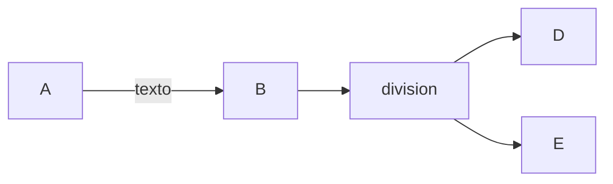

+++
title = 'Markdown'
date = 2024-10-04T13:40:24+02:00
draft = false
weight = 20
+++

## Edición básica

### Titulos

Para establecer los titulos usaré la siguiente sintaxis

```makefile
# titulo1
## titulo2
### titulo3
#### titulo4
##### titulo5
```
Y así se verá

# titulo1
## titulo2
### titulo3
#### titulo4
##### titulo5

---

### Negrita y formato

Para ver el texto en negrita escribo

```markdown
**Texto en negrita** Texto normal
```

Y se verá

**Texto en negrita** Texto normal

---

### Ver un vídeo de youtube
```markdown
{{`<>}}
```


##### Añadir botones:

PHP es un lenguaje interesante y bonito accede a la web

---

### Mermaid 



---
